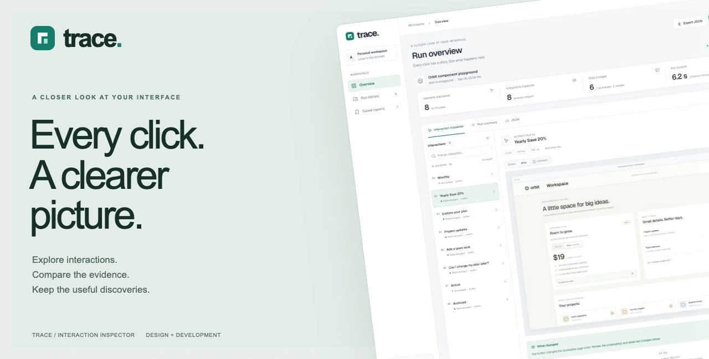

# Trace

**Understand every interaction.** Trace is a local website inspection workspace, rebuilt from Web Page Action Analyzer. Open a public documentation or test page, record how its controls respond, and inspect the evidence in one place.

## What works

- **Overview:** URL or built-in playground analysis, desktop/mobile viewports, 4/8/15-interaction limits, streamed progress, and cancellation.
- **Interaction inspector:** searchable and filterable controls, full-viewport before/after captures, draggable comparison, enlarged screenshots, selector copying, and observed accessibility changes.
- **Run history and Saved reports:** complete reports persist in this browser's IndexedDB. Bookmark, reopen, export JSON, or delete a report.
- **Preferences:** light, dark, and system appearance; default viewport and interaction limit. Preferences persist on this device.
- **Documentation and playground:** all destinations are available from the responsive sidebar. Orbit is a controlled interface with real billing toggles, a switch, dialog, accordion, seat counter, and project tabs.
- **Optional AI:** written interpretations via OpenAI. Evidence mode needs no API key, and observed evidence remains available if AI fails.

The bundled example is an actual recorded playground run, labeled **Example report**. It is not a live scan or a passing-test score.

## Run locally

Requires Node.js 20.9+ and Bun. A Chromium-compatible browser must be installed.

```sh
bun install --frozen-lockfile
bunx playwright install chromium
cp .env.example .env.local
bun run dev --hostname 127.0.0.1 --port 3040
```

Open [Trace on localhost](http://127.0.0.1:3040). If you already have Google Chrome, set `PLAYWRIGHT_CHANNEL=chrome` instead of installing Chromium. Set `PLAYGROUND_ORIGIN` to the app's origin if you change its port. Add `OPENAI_API_KEY` only if you want AI summaries.

For a production build running **locally**:

```sh
bun run build
bun run start --hostname 127.0.0.1 --port 3040
```

## How a run works

The server opens a fresh Playwright browser context, discovers visible buttons, links, inputs, selects, textareas, summaries, and supported ARIA controls, then inspects up to the chosen limit. Each interaction starts from a fresh page load. Captures cover the current viewport, not the entire document.

`Changed` means the accessible page state changed. `Unchanged` means no accessibility-tree difference was observed. `Skipped` includes disabled controls, unsupported actions, and controls that could not be exercised. These outcomes are observations, **not test assertions**. Purely visual changes may not appear in the accessibility diff, and asynchronous changes after the short observation window may be missed.

Forms are not submitted. Password/file/email inputs and likely destructive actions are skipped. Cross-site links, non-read HTTP requests, popups, and WebSockets are blocked. Runs have a two-minute deadline and one active run per server process. Reopening a page resets document state but is not a guarantee that all site cookies or storage are reset.

## API

`GET /api/analyze` reports whether AI and a browser installation are configured.

```sh
curl http://127.0.0.1:3040/api/analyze \
  -H 'Content-Type: application/json' \
  -d '{"playground":true,"viewport":"desktop","limit":8,"ai":false}'
```

POST accepts `{url, playground, viewport, limit, ai}`. Default responses preserve the original `annotations` array and add a complete `run`. Send `Accept: application/x-ndjson` for `progress`, `result`, and `error` events. Request validation uses HTTP errors; errors after streaming begins are NDJSON events.

## Checks

```sh
bun run lint
bun run typecheck
bun run test
bun run build
# With the local server running:
bun run test:integration
```

Integration tests run actual desktop and mobile browser captures against the controlled playground. Set `TRACE_TEST_ORIGIN` when the server uses another origin. `bun run verify` runs lint, type checking, unit tests, and a production build.

## Storage and deployment scope

Reports, screenshots, and bookmarks live in browser IndexedDB. They are not synced to an account. Export JSON before clearing site data; deleting a report removes its local copy. Preferences use localStorage.

The local server fetches target pages. Optional AI sends control labels and a limited before-state/diff to OpenAI; screenshots are not sent to AI. Avoid scanning sensitive pages.

This is a **local inspection tool**, not a hosted monitoring service. URL checks reject common private-network targets and request interception reduces unintended side effects. They are not a complete security sandbox or DNS-rebinding defense. A public deployment needs authentication, request limits, isolated browser workers, and enforced network egress controls. No scheduled monitoring, assertion engine, video replay, cloud synchronization, or account system is included.

## Implementation

Next.js 15, React 19, TypeScript, Tailwind CSS, Lucide, Playwright, IndexedDB, and the AI SDK with OpenAI. See [the design audit](docs/UI-AUDIT.md) for design decisions and reference products, and [validation notes](docs/VALIDATION.md) for verified coverage.
